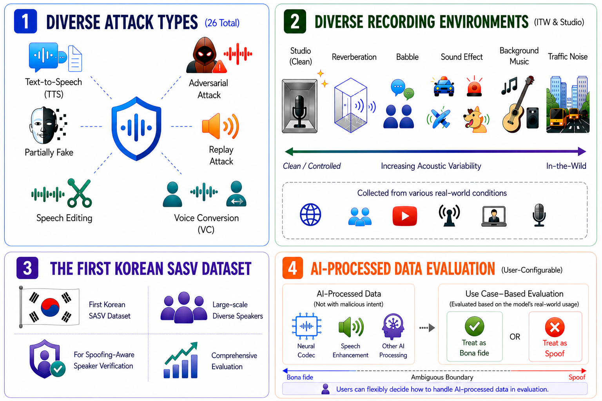

<div align="center">

# K-SORI

**Korean Speech anti-spOofing Research dataset with In-the-wild recordings**

[](https://huggingface.co/datasets/eoil/K-SORI)
[](https://creativecommons.org/licenses/by/4.0/)

</div>

<p align="center">
  
</p>

---

## Overview

K-SORI is a large-scale **Korean** speech dataset for spoofing and anti-spoofing research. It covers two attack scenarios:

| Scenario | Description | Utterances |
|----------|-------------|:----------:|
| **Logical Access (LA)** | TTS/VC spoofed (a01–a25) + AI-processed (p01–p09) + bonafide (a00) | 2,819,449 |
| **Physical Access (PA)** | Replay attacks — real rooms (R1, R2) + simulated RIRs | 593,252 |
| **Total** | | **3,412,701** |

### LA breakdown

| Split | Type | Utterances |
|-------|------|:----------:|
| a00 | Bonafide | 234,067 |
| a01–a25 | TTS / Voice Conversion | 1,951,899 |
| p01–p09 | AI-processed speech | 633,483 |

### PA breakdown

| Setting | Details |
|---------|---------|
| Rooms | R1, R2 (real) + simulated RIRs |
| Microphones | IRIVER, BLUE, BRIO, CROAD, SAMSUNG |
| Loudspeakers | gram (Kakao Mini), sony (SRS-XB13) |
| Total utterances | 593,252 |

---

## Dataset

The full dataset is available on HuggingFace:

> **[🤗 eoil/K-SORI](https://huggingface.co/datasets/eoil/K-SORI)**

```python
from datasets import load_dataset

# Logical Access
la = load_dataset("eoil/K-SORI", "LA")

# Physical Access
pa = load_dataset("eoil/K-SORI", "PA")
```

---

## Protocol Files

Protocol CSVs are available in the [`protocol/`](protocol/) directory.

### Scenario Protocols

| File | Description | Rows |
|------|-------------|:----:|
| `K-SASV_LA_protocol.csv` | Full LA protocol (a00–a25, p01–p09) | 2,819,449 |
| `K-SASV_PA_protocol.csv` | Full PA protocol (real + simulated replay) | 593,252 |

### Training Protocols

#### Standard (TTS/VC spoofing only)

| File | Split | Rows |
|------|-------|:----:|
| `K-SASV_train.csv` | Train | 1,652,172 |
| `K-SASV_eval.csv` | Eval | 308,833 |

#### Extended (includes AI-processed speech)

| File | Scenario | Split | Rows |
|------|----------|-------|:----:|
| `K-SASV_train_spoofing.csv` | Spoofing | Train | 2,066,045 |
| `K-SASV_eval_spoofing.csv` | Spoofing | Eval | 528,443 |
| `K-SASV_train_deepfake.csv` | Deepfake | Train | 2,066,045 |
| `K-SASV_eval_deepfake.csv` | Deepfake | Eval | 528,443 |

**Column descriptions (LA)**

| Column | Description |
|--------|-------------|
| `speaker_norm` | Normalized speaker ID |
| `path_audio` | Relative path to audio file |
| `age` | Speaker age group (Young / Adult / Elder) |
| `gender` | Speaker gender (M / F) |
| `recrdTime` | Recording duration (s) |
| `recrdEnv` | Recording environment |
| `recrdDevice` | Recording device |
| `type` | Attack type (a00 = bonafide, a01–a25, p01–p09) |
| `label` | bonafide / spoof / AI-processed |

---

## Pretrained Models

Models trained on K-SORI LA are available on Google Drive:

> **[📁 Google Drive — Pretrained Models](https://drive.google.com/drive/folders/1df5XEI54WAhug-su2nOGOd84q7JV7ghC?usp=sharing)**

| Model | Base Repository |
|-------|----------------|
| AASIST | [clovaai/aasist](https://github.com/clovaai/aasist) |
| Conformer-TCM | [ductuantruong/tcm_add](https://github.com/ductuantruong/tcm_add) |

Training followed the original configurations with K-SORI LA protocols as drop-in replacements.

---

## Citation

```bibtex
@dataset{k-sori,
  author    = {eoil},
  title     = {K-SORI: Korean Speech Anti-Spoofing Research Dataset},
  year      = {2026},
  url       = {https://huggingface.co/datasets/eoil/K-SORI}
}
```

---

## License

[CC BY 4.0](https://creativecommons.org/licenses/by/4.0/)
